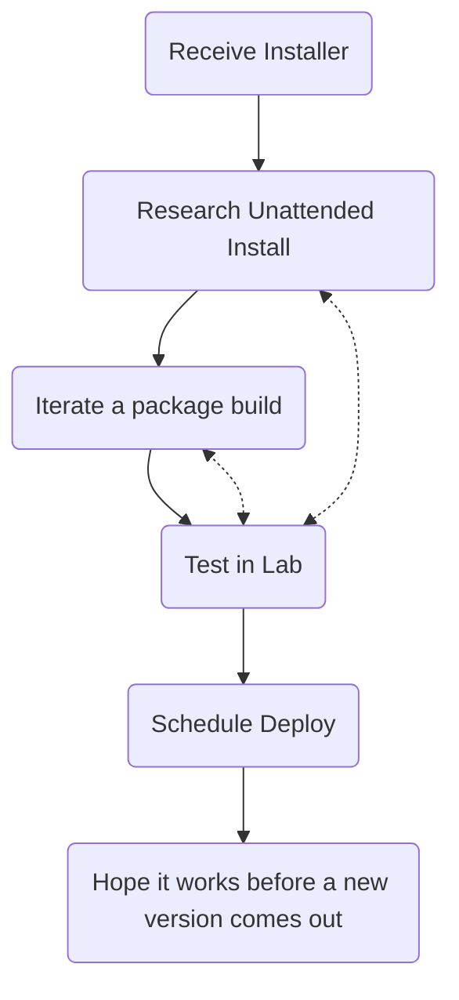

When considering application deployment, the "old" methodology sort of following the following path:

Frought with issues. Tough times. A lot of human suffering. The hardest part of this flow chart is that this is for *one* application. Each organization uses dozens of apps (if not hundreds). Keeping them all up to date, pushing new versions, all of it... An absolute mess. Every organization that I have been a part of has had people dedicated to this task (people that were smarter, more capable, and should have been doing better things). Thankfully, someone at Microsoft was listening! Not just listening, but actively cooking up a package management strategy that rivals our friends in the Linux world. Enter *winget*.

The promise of automated package management is very enticing. Of course, Microsoft released a product that didn't make sense in the current era, and we have to jump through a fair few hoops to make it all work towards the enterprise ideal of being powerful, and granular, and not insanely time-consuming. Here's what I've come up with!

## The full picture

Each management platform will certainly have their own quirks, Microsoft's own Intune is no exception to this. To build a package for deployment on workstations, generally the following are required:
    - Familiarity with the win32 content tool to bundle:
        - Installation script
        - Uninstall script
        - Detection script

Winget doesn't change this at all. The main difference is that we now have to consider versions and updates as a process. The difference in the process comes in the package updating process. Using Intune's "Proactive Remediations", we can execute a version check and update whatever is required. In my example, Adobe Acrobat is updated and checked for updates against the package in Winget's currently published version. 