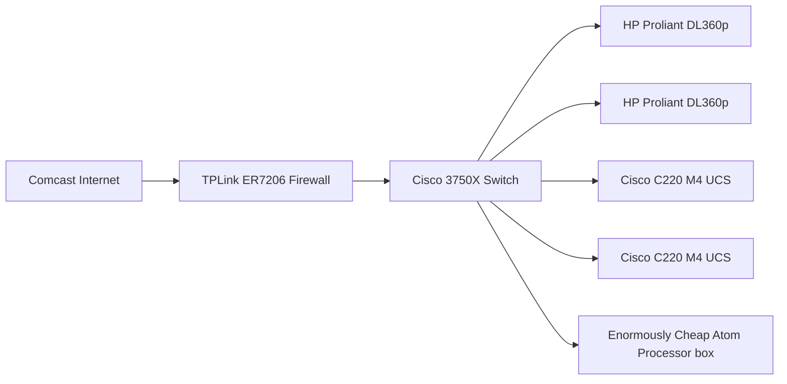

```mermaid
flowchart LR
    Internet[Comcast Internet]-->fw[TPLink ER7206 Firewall]
    fw-->Switch[Cisco 3750X Switch]
    Switch-->VMHost1[HP Proliant DL360p]
    Switch-->VMHost2[HP Proliant DL360p]
    Switch-->VMHost3[Cisco C220 M4 UCS]
    Switch-->VMHost4[Cisco C220 M4 UCS]
    Switch-->VMHost5[Enormously Cheap Atom Processor box]

```   
